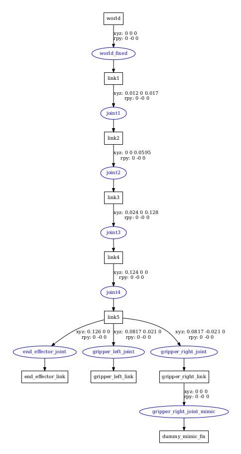
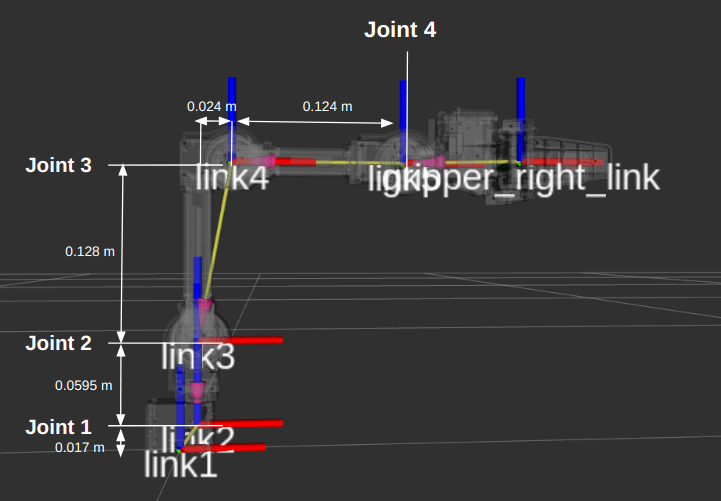

# Precision Weed Removal using OpenManipulator-X

## Final Review – 22MAT230 & 22AIE214

This project aims to develop a precision weed removal system using the OpenManipulator-X robotic arm. The system is designed to work within a simulated agricultural environment, integrating computer vision, machine learning, and robotic kinematics to detect and remove weeds efficiently. Our objective is to explore a low-cost, autonomous solution for modern farming challenges by combining:

- **Simulated Agricultural Environment**: Featuring realistic 3D models of crops and weeds in a physics-based simulation.
- **Manipulator Kinematics**: Applying both forward and inverse kinematics using OpenManipulator-X to enable accurate motion planning.
- **Weed Detection Model**: Training a machine learning model using image data collected from a virtual camera in the simulation.
- **Cost-Effective Weed Removal**: Designing innovative removal strategies with minimal hardware overhead.
- **System Integration**: Creating a cohesive autonomous system capable of identifying, classifying, and eliminating weeds.

---

## 👥 Team B-12

1. **Vishal S** – CB.SC.U4AIE23160  
2. **Meenakshi Sareesh** – CB.SC.U4AIE23144  
3. **Archith** – CB.SC.U4AIE23105  
4. **Jothika K** – CB.SC.U4AIE23133

# OpenManipulator-X

The **OpenManipulator-X** is a versatile, open-source robotic arm developed by ROBOTIS, designed to support research, education, and hobbyist robotics projects. Built with modularity and ROS (Robot Operating System) compatibility in mind, it provides an excellent platform for automation and precision-based tasks such as agricultural applications, including precision weed removal.

Key features of the OpenManipulator-X include:
- **4 Degrees of Freedom (DOF)** for precise movement and control.
- **DYNAMIXEL XM430-W350 servo motors**, known for their high torque and positional accuracy.
- **Lightweight aluminum frame**, offering durability without compromising portability.
- **ROS support**, enabling integration with various sensors, simulation environments (e.g., Gazebo), and control algorithms.
- **Open-source firmware and hardware schematics**, making it highly customizable.

Its compact size and flexibility make it ideal for tasks requiring accurate positioning and controlled actuation, such as detecting and removing weeds in tightly packed crop areas. The manipulator's structure allows for fine-grained movements needed to target specific weeds without damaging surrounding plants.

## OpenManipulator-X URDF Structure

Understanding the **URDF (Unified Robot Description Format)** of the OpenManipulator-X is essential for simulating and visualizing its movement in a virtual environment. URDF provides an XML-based format to describe the robot’s physical configuration, including its links, joints, sensors, and other elements necessary for accurate modeling in tools like RViz and Gazebo.

### Visualizing the OpenManipulator-X URDF Structure

Before analyzing the URDF breakdown, it's important to comprehend the hierarchical organization of the manipulator. The URDF structure defines how each part of the robot (links) is connected and moves (joints), enabling simulation and control of the real-world robot.

### Key Features of the URDF Graph

- **Root Node (`world`)**:
  - The base of the robot is fixed to the world frame using a `world_fixed` joint.

- **Link Structure** *(representing rigid bodies)*:
  - The robotic arm comprises five main links: `link1` through `link5`.
  - The `end_effector_link` is attached to `link5`, acting as the tool center point.
  - The gripper assembly includes `gripper_left_link` and `gripper_right_link`.

- **Joint Connections** *(defining mobility)*:
  - Links are connected using **revolute joints** from `joint1` to `joint4`, enabling rotational motion.
  - The gripper is actuated using **prismatic joints**: `gripper_left_joint` and `gripper_right_joint`.
  - A **mimic joint** (`gripper_right_joint_mimic`) ensures symmetrical movement of both gripper fingers.

### URDF Model in RViz

The image below shows the OpenManipulator-X as visualized in **RViz**, highlighting the joint positions, link alignments, and structure layout.

# Methodology

### Phase 1: Simulation Setup

The initial phase involves setting up a virtual agricultural environment to test and refine the weed removal strategy using the OpenManipulator-X in a simulated scenario.

#### Platform
- **Gazebo with ROS2 Integration**: The simulation is conducted in Gazebo, a widely-used robotics simulator, integrated with ROS2 for real-time control, sensor data processing, and communication between components.

#### Robot Setup
- **URDF Integration**: The OpenManipulator-X URDF is loaded into the Gazebo environment, ensuring accurate replication of its kinematics and structure.The manipulator arm responds correctly to motion commands.

#### Field Environment
- **Terrain**: A flat terrain from Gazebo’s built-in ground models is used to simulate an agricultural field.
- **Crop and Weed Modeling**:
  - **Crops**: The main crops are represented using **custom 3D models created in Blender** and are arranged in structured rows within the simulated field.
  - **Weeds**: **Artichoke** models are used to represent weeds and are randomly distributed across the field. These are also generated in **Blender** and placed using the **Automatic Row Crop Generator** – an open-source repository that automates the placement of crops and weeds in Gazebo environments.

This simulation setup provides a controlled environment to prototype and iterate on the precision weed removal mechanism before deploying it in a physical setting.

### Phase 2: Weed Detection

This phase focuses on training a computer vision model to accurately detect and localize weeds from field images. A deep learning-based object detection approach is used to ensure high accuracy and efficiency.

#### Dataset Preparation
- A custom dataset is curated with labeled images of crop and weed.
- Images are annotated using bounding boxes around the weeds, with labels indicating their class.
- The dataset includes various orientations, and occlusions to improve model generalization.

#### Training Details
- **Framework**: PyTorch with YOLO implementation.
- **Input**: Annotated field images with bounding boxes around weeds.
- **Output**: Trained model that predicts:
  - Bounding boxes around weeds in a new image.
  - Corresponding class label (e.g., "weed").
- **Confidence score for each detection.**-------------------------------------------------------------------------------------------------------------------------------------------------------------------------------------------------------------------------------------------------------------------------------------------------------------------------------------------------

#### Extracting 2D Coordinates
- For each weed detected, the model outputs the **(x, y)** pixel coordinates of the bounding box center in the image frame.
- These coordinates represent the weed’s location in 2D image space, which will later be used for spatial mapping and targeted removal.

This phase ensures a robust weed detection system is in place for precision targeting and actuation.

### Phase 3: Forward Kinematics (FK)

Forward kinematics is the process of determining the position and orientation of the end-effector given the joint angles of the robotic arm. This is essential for guiding the manipulator to interact accurately with detected weeds.

#### Robot Structure Definition
The OpenManipulator-X is modeled as a series of interconnected links and joints, forming a kinematic chain. Each joint defines a relative transformation between two links — incorporating both rotation and translation.

#### Transformation Matrices
For every joint in the robot, a **transformation matrix** is defined. This matrix encapsulates the relative position and orientation between two consecutive links. The transformation includes:
- **Rotation**: Based on the joint angle for revolute joints.
- **Translation**: Based on the physical offsets between the links as defined in the robot’s structure.

These transformations are represented using **homogeneous matrices**, allowing both rotation and translation to be computed in a unified manner.

#### Joint Angle Acquisition
To dynamically compute the forward kinematics, the system listens to real-time joint state updates. Joint angles are continuously obtained by subscribing to the appropriate ROS2 topic that publishes joint state information. This ensures that the transformation matrices reflect the actual physical configuration of the manipulator at any moment.

#### End-Effector Position Computation
To compute the position of the end-effector:
1. Begin from the base frame of the robot.
2. Apply the transformation matrix for each joint sequentially, starting from the base and moving up to the end-effector.
3. Multiply all the transformation matrices in order to get the final transformation from the base to the end-effector frame.

**T_total = T1 × T2 × T3 × T4 × T5**

This cumulative matrix provides the **position and orientation** of the end-effector in the world coordinate frame.

#### Mathematical Summary
- **Transformation Chain**: Each link-to-link movement is described by a matrix combining rotation and translation.
- **Final Pose**: The multiplication of all individual matrices gives the final pose of the end-effector.
- **Precision**: This step is critical for ensuring that the manipulator accurately reaches the target weed positions identified during the detection phase.

## **Phase 4 - Inverse Kinematics (IK)**

### **Generate Dataset**
To train the inverse kinematics model, a dataset was generated by simulating the robot in **Rviz**. The robot was moved continuously across different configurations to collect diverse joint angle and end-effector pose pairs.

- Total data points collected: **~20,000**
- Each entry includes:
  - **Joint angles** (ground truth)
  - **End-effector position and orientation** (forward kinematics output)

This data served as the foundation for supervised training of the neural network.

The follwoing describes the mathematical formulation of a **multi-layer perceptron (MLP)** for **inverse kinematics (IK)**. The model predicts **joint angles** from the **end-effector pose**.

---

## **Data Normalization**
Each input feature \( x \) is normalized using:

$$
X' = \frac{X - \mu}{\sigma}
$$

where:
- $\mu$ is the **mean** of each feature.
- $\sigma$ is the **standard deviation** of each feature.

---

## **Neural Network Architecture**
- **Input Layer**: 7 neurons (pose features)
- **Hidden Layers**: [256, 128, 64, 32]
- **Output Layer**: 4 neurons (joint angles)
- **Activation**: Leaky ReLU
- **Regularization**: Dropout (0.2)
- **Optimizer**: Adam

---

## **Xavier Initialization**

$$
W \sim \mathcal{N} \left( 0, \frac{2}{\text{fan-in} + \text{fan-out}} \right)
$$

---

## **Leaky ReLU Activation**

Forward:

$$
f(x) =
\begin{cases}
x, & x > 0 \\
0.01x, & x \leq 0
\end{cases}
$$

Derivative:

$$
f'(x) =
\begin{cases}
1, & x > 0 \\
0.01, & x \leq 0
\end{cases}
$$

---

## **Forward Propagation**

Linear step:

$$
z^{(i)} = W^{(i)} a^{(i-1)} + b^{(i)}
$$

Activation:

$$
a^{(i)} = \text{LeakyReLU}(z^{(i)})
$$

Dropout:

$$
a^{(i)} = a^{(i)} \cdot \frac{\text{mask}}{1 - p}
$$

---

## **Huber Loss**

$$
L(y, \hat{y}) =
\begin{cases}
\frac{1}{2} (y - \hat{y})^2, & \text{if } |y - \hat{y}| < \delta \\
\delta (|y - \hat{y}| - 0.5 \delta), & \text{otherwise}
\end{cases}
$$

---

## **Backpropagation**

Gradient wrt output:

$$
\frac{\partial L}{\partial a} = 2 \cdot (y_{\text{pred}} - y_{\text{true}})
$$

Gradient wrt weights:

$$
\frac{\partial L}{\partial W} = a^T \cdot \frac{\partial L}{\partial a}
$$

Gradient wrt bias:

$$
\frac{\partial L}{\partial b} = \sum \frac{\partial L}{\partial a}
$$

---

## **Adam Optimizer**

Moments:

$$
m_t = \beta_1 m_{t-1} + (1 - \beta_1) g_t
$$

$$
v_t = \beta_2 v_{t-1} + (1 - \beta_2) g_t^2
$$

Bias correction:

$$
\hat{m_t} = \frac{m_t}{1 - \beta_1^t}, \quad \hat{v_t} = \frac{v_t}{1 - \beta_2^t}
$$

Update rule:

$$
W_t = W_{t-1} - \alpha \cdot \frac{\hat{m_t}}{\sqrt{\hat{v_t}} + \epsilon}
$$

---
## Phase 5: Control using Hardware
-  We Implemented the control part of our project by leveraging computer vision, machine learning, and robotic control. We used ufactory Lite 6 robotic arm with API based model inferencing.
## Hardware Components
### Lite 6

- The UFACTORY Lite 6 is a lightweight 6-axis robot with a 600 g payload capacity and 0.5 mm repeatability, designed for space-saving applications that do not require high accuracy.

### Lenovo Essential FHD Webcam

- The Lenovo FHD Webcam is powered by a Full HD 1080P 2 Megapixel CMOS camera
- We setup the camera in a tripod.

## SOFTWARE
- Computer Vision Pipeline: Captures and processes images from the camera
- Coordinate Transformation System: Maps pixel coordinates to robot arm coordinates using linear regression
- AI Model Integration: Leverages Groq's API with the Llama 4 Scout model to detect objects and determine their centroids
- Control Software: Manages the end-to-end workflow and communicates with the robotic arm
## DATA FLOW
> Camera --> AI Model --> Coordinate Transformation --> Robotic Arm

### 1. Camera Calibration
Camera calibration is essential for establishing an accurate mapping between the camera's pixel coordinates and the robot's physical coordinate system. The calibration process involves:
- **Data Collection**: Coordinates of the robotic arm and webcam were collected for corresponding points, such that for a point we have the coordinates from the webcam and coordinates of the same point from the robotic arm end effector.
- **Linear Regression**: A mathematical model is derived to map between the two coordinate systems.

<pre>camera_pixel_coords = np.array(camera_pixel_coords)
robot_coordinates = np.array(robot_coordinates)

camera_x = camera_pixel_coords[:, 0]
camera_y = camera_pixel_coords[:, 1]
robot_x = robot_coordinates[:, 0]
robot_y = robot_coordinates[:, 1]

A_x = np.vstack([camera_x, np.ones(len(camera_x))]).T
theta_x = np.linalg.pinv(A_x) @ robot_x
m1, c1 = theta_x    

A_y = np.vstack([camera_y, np.ones(len(camera_y))]).T
theta_y = np.linalg.pinv(A_y) @ robot_y
m2, c2 = theta_y

print(f"robot_x = {m1:.4f} * camera_x + {c1:.4f}")
print(f"robot_y = {m2:.4f} * camera_y + {c2:.4f}")</pre>

** We mapped out problem in the form of linear equations of the form
>*y = mx + c*

We want to find m and c that minimize the squared error between the predicted and actual robot coordinates. The linear equation can be written as
> A @ theta ≈ y
> 
> where,\
> A = [[x₁, 1], [x₂, 1], ..., [xₙ, 1]] (shape: n × 2)\
> theta = [m, c]^T\
> y = [y₁, y₂, ..., yₙ]^T

The least squares solution is:
> theta = (Aᵀ A)⁻¹ Aᵀ y

Here, we can use **pseudo-inverse** and find *theta* by
> theta = np.linalg.pinv(A) @ y

For X direction:
> A_x = np.vstack([camera_x, np.ones(len(camera_x))]).T  # shape: (n, 2)\
theta_x = np.linalg.pinv(A_x) @ robot_x

For Y direction:
> A_y = np.vstack([camera_y, np.ones(len(camera_y))]).T\
theta_y = np.linalg.pinv(A_y) @ robot_y  # gives [m₂, c₂]

Given pairs of camera pixel coordinates and corresponding robot coordinates, we establish linear equations of the form:
> robot_x = m1 * camera_x + c1
> 
> robot_y = m2 * camera_y + c2

*The m and c values are parameters(slopes and intercepts) of a linear equation that maps camera pixel coordinates to robot coordinates. They are essential because they let you convert any new pixel coordinate from the camera (e.g., from object detection) to a real-world coordinate in the robot's frame.*

### 2. AI Inference using API
We used **llama-4-scout-17b-16e-instruct** model to enhance the vision capabilities of our project.
#### llama-4-scout-17b-16e-instruct
##### Meta's Llama 4 Scout is a 17 billion parameter model with 16 experts that is natively multimodal. These models leverage a mixture-of-experts architecture to offer industry-leading performance in text and image understanding.

The **API** service we used was from **Groq**.

The images were fed into the AI-model and coordinates were extracted by:
- Converting images to base64 encoding for API transmission
- Creating a specific prompt to extract object information
- Sending requests and handling responses
- Parsing the JSON output to extract object coordinates

### 3. Coordinate Transformation
The coordinate transformation module uses the parameters determined during calibration to convert pixel coordinates to robot coordinates. The transformation is a critical step in ensuring that the robot can accurately reach the detected objects.

After receiving centroid coordinates from the AI model, the system applies the transformation equations:

- Extract centroid coordinates from the model's JSON output
- Normalize the coordinates
- >Need to add equation
- Apply the transformation using the calibration parameters
- Pass the transformed coordinates to the robot control system

### 4. Pick and Place
Pick and place was achieved in this project via a pick and place function which took *pick coordinates* and *place coordinates* as arguments. The function will pick objects from the pick coordinates and place them in the place coordinates.

## Challenges
### Caibration
- **Perspective Distortion**: The camera's perspective view introduced non-linearities in the mapping.
- **Solution**: Using multiple calibration points across the workspace to improve accuracy.
### Setting up API
- **Prompt engineering**:  Creating a prompt that consistently extracted the required information
- **Solution**: Iterative refinement of the prompt with clear formatting requirements

We succesfully implemented control and made use of model inferencing to enhance vision capabilities. We devoloped a complete end-to-end pipeline from perception to action. This project is a flexible automation that can adapt to variations in object placement.

------
